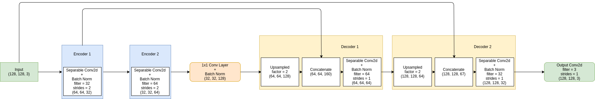
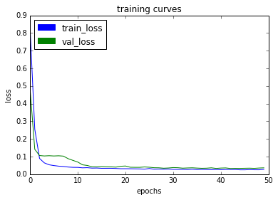
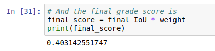

## Deep Learning Project ##

In this project, you will train a deep neural network to identify and track a target in simulation. So-called “follow me” applications like this are key to many fields of robotics and the very same techniques you apply here could be extended to scenarios like advanced cruise control in autonomous vehicles or human-robot collaboration in industry.

## Write Up ##

### Fully Convolutional Neural Network Model

A fully convolutional neural network (FCN) with the encoder-decoder structure of is implemented in the project. The architecture of the model is demonstrated in the following figure. In this figure, both the encoder and decoder have two layers. The sizes of each layer is described.

In the implementation later, a three-layer network in the encoder and decoder have been implemented as well to compare their difference in performance.

#### Encoder
The encoder here with separable convolution is to extract features in the image. The separable convolutions have fewer parameters compared to traditional convolutions and their advantages are:
1. Efficiency
2. Reducing over-fitting.

#### 1 by 1 Convolutions
1. The fully connected layer is used for classification of multiple classes.
1. When we transform the output of a convolutional layer into a fully connected layer, it is flattened into a 2D tensor. This leads to the loss of spatial information due to the missing informatio of the position in the image.
2. This could be avoided using 1x1 convolutions.

#### Decoder
The decoder is to up-sample the output from 1x1 convolution layer to the same size as the input image using transpose convolution.

### Parameters
| Tables   |      Are                                                     |  Score |
|----------|:------------------------------------------------------------:|-------:|
| Baseline |  Learning Rate = 0.002; Batch Size = 100, Num of Epochs = 50 | 0.403  |
| Trial 1  |  Num of Epochs = 10       |   0.002  |
| Trial 2  |  Learning Rate = 0.0025   |   0.355  |
| Trial 3  |  Learning Rate = 0.0015   |   0.330  |
| Trial 4  |  Batch Size = 50          |   0.399  |
| Trial 5  |  Batch Size = 50, Num of Epochs = 100                        | 0.296  |
| Trial 6  |  Three-Layer Network      |   0.394  |
| [Trial 7](model_training_trial_7.html)  |  Three-Layer Network, Batch Size = 50, Num of Epochs = 100   | 0.400  |

#### Baseline

### Weights
[I'm an inline-style link](https://www.google.com)

### Limitations

The model would not be able to
