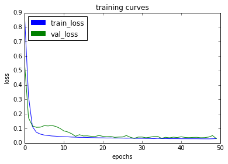

## Deep Learning Project ##

In this project, you will train a deep neural network to identify and track a target in simulation. So-called “follow me” applications like this are key to many fields of robotics and the very same techniques you apply here could be extended to scenarios like advanced cruise control in autonomous vehicles or human-robot collaboration in industry.

## Write Up ##

### Results

#### HTML File

[HTML File for Trial 7](model_training_trial_7.html)

#### Weights

[Config File for Trial 7](data/weights/config_model_weights_trial_7)
[Weight File for Trial 7](data/weights/model_weights_trial_7)

### Fully Convolutional Neural Network Model

A fully convolutional neural network (FCN) with the encoder-decoder structure is implemented in the project. The architecture of the model is demonstrated in the following figure. In this figure, both the encoder and decoder have two layers. The sizes of each layer is described.

In the implementation later, a three-layer network in the encoder and decoder have been implemented as well to compare their difference in performance.

#### Encoder
The encoder here with separable convolution is employed to extract features in the image. The separable convolutions have fewer parameters compared to traditional convolutions and their advantages are:
1. Efficiency
2. Reducing over-fitting

#### 1 by 1 Convolutions
1. The fully connected layer is used for classification of multiple classes.
2. When we transform the output of a convolution layer into a fully connected layer, it is flattened into a 2D tensor. This leads to the loss of spatial information due to the missing information of the position in the image. And this could be avoided using 1x1 convolutions.
3. In addition, the 1x1 convolution layer has a parameter, namely, the number of filters, which is a parameter that could be tweaked.

#### Decoder
The decoder is to up-sample the output from 1x1 convolution layer to the same size as the input image using bilinear upsampling.

### Parameters
| Iteration|      Parameters                                                                             |  Score |
|----------|:-------------------------------------------------------------------------------------------:|-------:|
| [Baseline](model_training_baseline.html)|  Learning Rate = 0.002; Batch Size = 100, Num of Epochs = 50 | 0.348  |
| Trial 1  |  Num of Epochs = 20       |   0.221  |
| Trial 2  |  Learning Rate = 0.0025   |   0.355  |
| Trial 3  |  Learning Rate = 0.0015   |   0.330  |
| Trial 4  |  Batch Size = 50          |   0.399  |
| [Trial 5](model_training_trial_5.html)  |  Batch Size = 50, Num of Epochs = 100                        | 0.296  |
| [Trial 6](model_training_trial_6.html)  |  Three-Layer Network                                         | 0.394  |
| [Trial 7](model_training_trial_7.html)  |  Three-Layer Network, Batch Size = 50, Num of Epochs = 100   | 0.400  |

#### Learning Rate

Based on the results from Baseline, Trial 2, and Trial 3, no significant difference between Learning Rate = 0.0015, 0.002, 0.0025 is observed. Therefore it looks like Learning Rate = 0.002 is a reasonable value.

#### Batch Size

Based on the results from Baseline and Trial 4, Bath Size = 50 leads to better results. Similarly, in the paper presented by [Keskar et al., 2016](https://arxiv.org/abs/1609.04836), it is stated that when using a larger batch there is a significant degradation in the quality of the model, as measured by its ability to generalize. Therefore large batch size should be avoided.

#### Number of Epochs

Based on the results from Trial 4, 5, 6, and 7, with approximately 4000 images in the training data and 1000 images in the validation data, Num of Epochs = 50 would be a good number for the two-layer network and Num of Epochs = 100 would be a good number for the three-layer network. Larger Num of Epochs could lead to over-fitting and reduced performance in generalization.

#### Baseline

#### Trial 7

### Limitations

The model would not be able to identify other objects such as dog, cat, etc. due to the fact that they are not labeled in the training and validation data. If these classifications are needed, they will need to be labeled as in the current mask data set.

Further performance improvement by data collection and augmentation. For example, images could be flipped and normalized.

Another thing to notice is that the score could vary significantly. For example, for the same setting as the Baseline model, the scores could change from 0.2 to 0.4. Therefore, the results presented here could be only of limited reference value.
